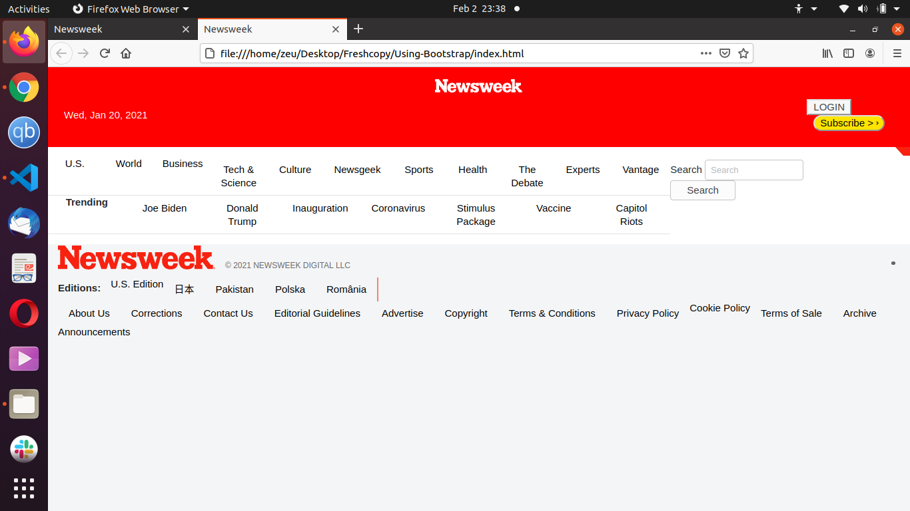

# USING BOOTSTRAP

Building a web page that matches the appearance of this page [NEWS WEEK](https://www.newsweek.com/) using bootstrap.

# Built With

- [HTML](https://developer.mozilla.org/en-US/docs/Web/HTML)
- [Bootstrap](https://getbootstrap.com/)
- [CSS](https://www.w3schools.com/css/)
- [Fontawesome](https://fontawesome.com/)

# Original Page

  

# Live Demo

# Getting Started

The repository for this project is open source and open for contributions. 
When you visit the [issues page](https://github.com/Fondem-Jr/Using-Bootstrap/), click on code and you will find clone to the right of the page. You can either Download or copy the link and do a "git clone repository-link" in the terminal.
You will now have my project in your local machine and you are ready to start working on it.

# Author

### Fondem Junior
- Github: [@Fondem-Jr](https://github.com/Fondem-Jr)
- Twitter: [@OpportunistZeus](https://twitter.com/Zeus)
- Linkedin: [Fondem Junior](www.linkedin.com/in/fondem-junior-57484744)

# Contributing
Contributions, issues and feature requests are welcome!

# Show your support
If you like our work, please give us a :+1:

# Acknowledgments
- Microverse
- W3schools
- Freecodecamp
- Developer.mozilla
- Learnshayhowe
- Odin project
- Hackerthemes
- Getbootstrap

# License
This project is [MIT](https://opensource.org/licenses/MIT) licensed.
